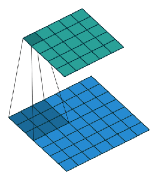
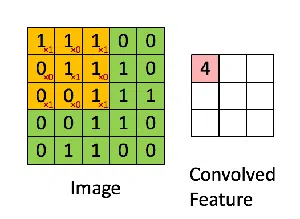

# PROYECTO-CNN

Aumento de Imagenes con Redes Neuronales Convolucionales

Instituto Superior Politécnico Córdoba

Tecnicatura Superior en Ciencia de Datos e Inteligencia Artificial

Profesor: Narciso Perez

Alumno: Medina Jorge

Redes Neuronales con TensorFlow Y Keras

Capas Convolucionales

Éstas capas son las encargadas de conectar cada neurona con una región específica de la imagen. La manera de hacer esto es aplicando lo que se conoce como una ventana de convolución o, de manera más sencilla, un filtro.

